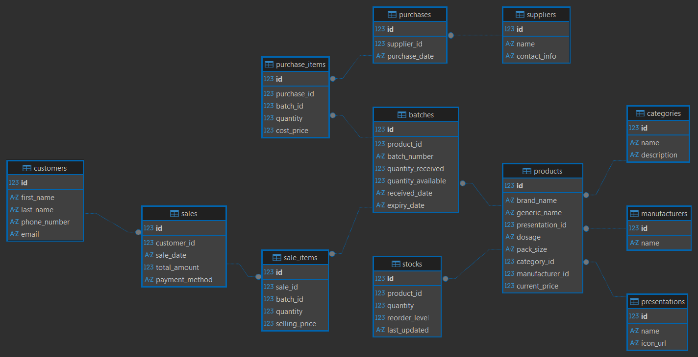

# Design Document

By Cyril Tetteh

Video overview: [Pharmacy Database Overview](https://youtu.be/BkyIhdpuprY)

## Scope

In this section you should answer the following questions:

* What is the purpose of your database?

    This database is designed to manage pharmacy sales and operations and can serve as the database for a pharmacy management software.
    It tracks pharmaceutical products, purchases from suppliers and sales to customers. The database may be used to monitor and control stocks, identify expired product batches and track batches which is important for pharmacies. 

* Which people, places, things, etc. are you including in the scope of your database?
    - People:
        - **Customers** purchasing pharmaceutical products
        - **Suppliers** providing products
        - **Manufacturers** producing the products
    - Things:
        - Products (medicines)
        - Batches of medicines
        - Stock levels
        - Sales transactions
        - Purchase transactions
        - Product categories
        - Product presentations (tablet, capsule, syrup, cream, etc)

* Which people, places, things, etc. are *outside* the scope of your database?

    This database primarily focuses on inventory and transaction management, not full healthcare workflows. As a result, the following operations are **not covered** in its scope:
    - Multi-branch operations
    - Product returns from customers
    - Prescription filling and storage
    - Insurance billing
    - Employee/user/pharmacist records and actions
    - Product returns to suppliers
    - Advanced accounting

## Functional Requirements

In this section you should answer the following questions:

* What should a user be able to do with your database?

    A user should be able to:

    **Product Management**
    - add and manage pharmaceutical products
    - categorize products
    - assign manufacturers and presentations
    
    **Inventory Management**
    - record batches of medicines received
    - track expiry dates
    - monitor stock levels
    - identify low stock products

    **Procurement**
    - record purchases from suppliers
    - track purchase items linked to batches

    **Sales**
    - record sales transactions
    - record individual sale items
    - track which batch each sale came from

    **Monitoring**
    - view expired batches
    - view low stock products
    - analyze product sales summaries

* What's beyond the scope of what a user should be able to do with your database?

    The system does not allow:
    - automatic inventory forecasting
    - pricing algorithms
    - prescription validation
    - integration with hospital systems
    - supplier contract management
    - customer loyalty programs
    - multi-currency financial accounting

    These features would require a more advanced system.

## Representation

### Entities

In this section you should answer the following questions:

* Which entities will you choose to represent in your database?

    The following entities are represented in the database
    * Product related entities
        - **Products**: brand_name, generic_name, dosage, pack_size, current_price
        - **Categories**: classification of medicines according to therapeutic use
        - **Presentations**: physical form of the pharmaceutical product
        - **Manufacturers**: companies producing the medicines

    * Inventory entities
        - **Batches**: batch_number, quantity_received, quantity_available, received_date, expiry_date

    * Supply-chain entities
        - **Suppliers**: organizations supplying medicines
        - **Purchases**: purchase transactions from suppliers
        - **Purchase items**: line items representing batches purchased

    * Sales entities
        - **Customers**: individuals purchasing pharmaceutical products from the pharmacy
        - **Sales**: distinct purchasing transactions by customers for at least one product
        - **Sales items**: products sold in each sale.
    
    * Stock entities
        - **Stocks**: tracks current stock levels per poduct and includes reorder level
        
* What attributes will those entities have?

    - INTEGER: used for primary keys and quantities 
    - TEXT: used for names batch numbers and timestamps 
    - REAL: used for pricing fields

* Why did you choose the types you did?

    - INTEGER: supports indexing and suitable for identifiers and counts  
    - TEXT: suitable for descriptive attributes
    - REAL: allows decimals for monetary values
 
* Why did you choose the constraints you did?

    - PRIMARY KEY: this ensures every record has a **unique identifier**
    - UNIQUE: to prevent duplicate records for enteries like batch numbers, etc.
    - CHECK: to limit entries to specific options for payment options
    - FOREIGN KEY: to enforce the relationship between two entities

### Relationships

In this section you should include your entity relationship diagram and describe the relationships between the entities in your database.

#### Entity Relationship Diagram

Product Classification Relationships
Products are categorized and described using three supporting tables: categories, manufacturers, and presentations.
Each product belongs to exactly one category, one manufacturer, and one presentation type. However, each category, manufacturer, or presentation may be associated with many products. For example, a category such as Antibiotics may contain multiple drugs, and a manufacturer such as Pfizer may produce many pharmaceutical products. This design ensures that product attributes are stored once and reused across many product records, improving consistency and reducing redundancy.

Product and Batch Relationship
Each product may be received in the pharmacy in multiple batches over time. A batch represents a specific shipment or production lot of a product and typically includes details such as:
    - batch number
    - quantity received
    - expiry date
    - date received

Tracking inventory at the batch level is essential in pharmacy systems because drugs from different batches may have different expiry dates. This allows the pharmacy to manage stock rotation and remove expired medicines when necessary. Thus, while each batch belongs to a single product, a product may have many batches.

Procurement Relationships
The procurement process tracks how products enter the pharmacy’s inventory. Suppliers provide products to the pharmacy through purchase transactions. Each supplier may be associated with many purchases over time. A purchase record represents a procurement transaction and may contain multiple items. The individual items within a purchase are recorded in the purchase_items table, which stores details about each product included in the purchase. Each purchase item corresponds to a specific batch created in the batches table when the stock is received. This linkage ensures that the system can trace each batch of products back to the supplier and purchase transaction that introduced it into the inventory.

Sales Relationships
Customer transactions are handled through a sales system consisting of three tables: customers, sales, and sale_items. Each customer may make multiple purchases from the pharmacy. A sales record represents a single transaction and stores information such as the sale date and the customer involved. Because a sale may include multiple products, the individual items in the transaction are stored in the sale_items table. Each sale item references a specific batch rather than only a product. This allows the system to accurately deduct inventory from the correct batch and maintain traceability for pharmaceutical safety and regulatory purposes.

Stock Summary Relationship
The stocks table maintains a summarized view of the available inventory for each product. While batches track inventory at a detailed level, the stocks table provides a simplified summary showing the total quantity available for each product. Each product therefore has a single corresponding stock record that aggregates the quantities of its active batches. This structure allows the system to support both detailed batch-level tracking and efficient queries for overall product availability.

## Optimizations

In this section you should answer the following questions:

* Which optimizations (e.g., indexes, views) did you create? Why?

    One important optimization involves the use of indexes on frequently searched fields. In the products table, indexes were created for both the brand_name and generic_name columns. These indexes significantly improve the speed of product searches, which are expected to be one of the most common operations in the system. Pharmacists or sales systems often need to locate products quickly by either their commercial name or generic name, and indexing these fields allows the database engine to retrieve matching records efficiently without scanning the entire table.

    Another index was created on the sale_items table for the sale_id column. Because each sale transaction may include multiple items, queries that retrieve all items belonging to a particular sale are expected to occur frequently. Indexing this column improves the performance of these lookups, particularly when generating receipts, reviewing transaction histories, or performing sales analysis.

    Several views were created to simplify common queries and improve data accessibility. The low_stock_products view identifies products whose stock has fallen below the reorder level, while the expired_batches view lists batches whose expiry dates have passed. The sales_details view combines sales, product, and batch information to provide detailed records of each sale without requiring complex joins. Additionally, the product_sales_summary view aggregates sales data to show total quantities sold and revenue by product, enabling basic sales analysis.

    A trigger named update_stock_after_batch_insert was also implemented to automatically update the stocks table whenever a new batch is inserted. This ensures that inventory totals remain synchronized with batch records and reduces the risk of manual update errors.

## Limitations

In this section you should answer the following questions:

* What are the limitations of your design?

    One limitation concerns the use of the stocks table to store aggregated inventory levels. Because the total quantity of each product can be derived from the batches table, storing this value separately introduces a degree of redundancy. While this design improves query efficiency, it also creates the possibility of inconsistencies if the aggregated values are not properly synchronized with the underlying batch records. Triggers were implemented to mitigate this issue, but the risk remains if future modifications bypass these mechanisms.

* What might your database not be able to represent very well?

    The schema also lacks support for employee management. Real-world pharmacy systems typically record information about pharmacists, cashiers, and other staff members who interact with the system. Such data is useful for auditing transactions, managing user permissions, and maintaining accountability. Since employee records are not included, the current design cannot track which staff members processed particular purchases or sales.

    Additionally, the database assumes that the pharmacy operates from a single location. Inventory, purchases, and sales are therefore stored without any reference to a specific branch or store. Supporting multiple pharmacy locations would require the introduction of additional entities, such as a stores table, along with relationships that link inventory, purchases, and sales to individual branches.
